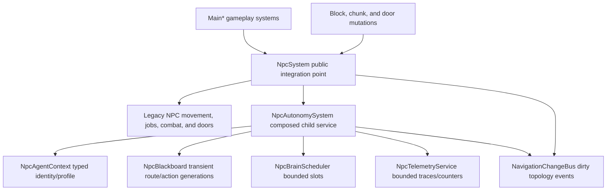
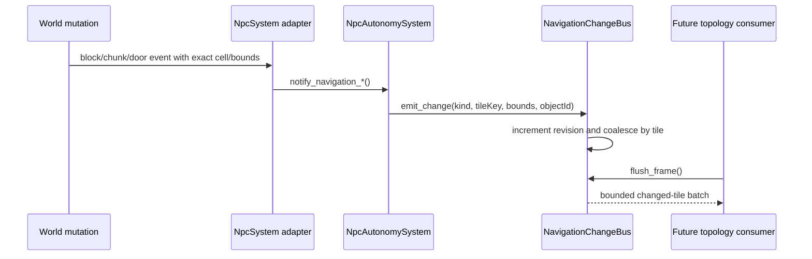

# Phase 01 Report - Typed Contracts, Composition Root, Change Bus, and Telemetry Skeleton

## 1. Phase Identification

- Phase: 01 - Typed Contracts, Composition Root, Change Bus, and Telemetry Skeleton
- Branch: `npc-pathfinding/phase-01-contracts-observability`
- Base branch: `master`
- Base commit: `ac5f12fc20b50740abc79bf9492220ed7c07e648`
- Branch implementation commit: `1006d4826bd456784a2a50a9395c0737e4956634`
- Merge commit: `ab7a5b7f9102355a11de246f4350d7e0cad113ba`
- Repair branch: `npc-pathfinding/phase-01-master-repair`
- Repair commit: `95ae58612f41948e4f06a7b27ff8155629829b57`
- Repair merge commit: `3a470f78113f7946731e73d30bffe07256778d40`
- Dates: 2026-06-25
- Controlling specification: `CODEX_NPC_PATHFINDING_FINAL_IMPLEMENTATION_PLAN.md`

## 2. Objective

Phase 01 establishes the typed runtime boundary needed for the NPC autonomy and navigation replacement while preserving the legacy locomotion, route, job, combat, and door behavior path.

This phase intentionally does not migrate NPC bodies to `CharacterBody3D` or replace legacy movement. The active production locomotion mode remains `legacy_static_body_adapter`.

## 3. Pre-Phase State

- `git status --short` before Phase 01 edits showed one pre-existing modified tracked baseline: `artifacts/baselines/world-signature/atlas-1492.json`.
- That baseline artifact remained unstaged and outside the Phase 01 changes.
- Phase 01 started from the green Phase 00 `master` commit `ac5f12fc20b50740abc79bf9492220ed7c07e648`.
- The legacy NPC stack still owns physical movement through `StaticBody3D` actors and legacy route intent. Phase 01 only adds typed runtime contracts and observability around that stack.

## 4. Implementation Summary

Phase 01 adds `NpcAutonomySystem` as a composed child service under `NpcSystem.gd`. The service owns runtime-only typed state for each registered NPC:

- `NpcAgentContext`
- `NpcBlackboard`
- `TraversalProfile`
- per-NPC deterministic RNG helpers
- `NpcBrainScheduler`
- `NpcTelemetryService`
- `NavigationChangeBus`

`NpcSystem.register_npc()` now associates each legacy NPC entry with typed runtime context and blackboard data while leaving public behavior and save-facing dictionaries intact.

World mutation sites now forward adapter events into the navigation change bus:

- block create
- block remove
- chunk load
- chunk unload
- legacy door state changes

The legacy navigation consumer remains active and unchanged. The new change bus is event-driven, bounded, and ready for the Phase 03 topology service.

## 5. Ownership And Data Flow



Ownership is single-source by state type:

| State | Owner | Persistence |
| --- | --- | --- |
| Legacy NPC dictionaries | `NpcSystem.gd` | Existing save boundary only |
| Stable NPC identity/profile | `NpcAgentContext` | Runtime-only in Phase 01 |
| Current route/action generation | `NpcBlackboard` | Runtime-only |
| Brain update slots | `NpcBrainScheduler` | Runtime-only |
| Telemetry rings/counters | `NpcTelemetryService` | Runtime-only |
| Dirty navigation events | `NavigationChangeBus` | Runtime-only |

Save snapshots remain dictionary-based and do not include `agentContext`, `blackboard`, scheduler queues, telemetry rings, change-bus queues, route generations, or RNG stream state.

## 6. Event Flow And Queue Bounds

World mutation adapters call `NpcSystem.notify_navigation_*()`, which delegates to `NpcAutonomySystem`, which records a typed change in `NavigationChangeBus`.



Phase 01 bounds:

| Structure | Owner | Bound | Overflow behavior |
| --- | --- | ---: | --- |
| Per-NPC telemetry ring | `NpcTelemetryService` | 256 | Evicts oldest per actor |
| Global telemetry counters | `NpcTelemetryService` | 128 | Ignores new counter keys after bound |
| Registered brain agents | `NpcBrainScheduler` | 256 | Rejects extra registrations and counts denial |
| Brain updates per tick | `NpcBrainScheduler` | 8 | Defers remaining slots deterministically |
| Pending changed tiles | `NavigationChangeBus` | 512 | Drops excess new tile buckets and counts drops |
| Blackboard distance history | `NpcBlackboard` | default 16 | Evicts oldest samples |

The change bus increments a monotonic revision on every emitted change and coalesces repeated tile events until `flush_frame()`. Tested coalesced events carry tile key, revision, change kinds, object IDs, merged bounds, source revisions, and coalesced count.

## 7. Contracts Introduced

Core files added:

- `scripts/npc_ai/NpcEnums.gd`
- `scripts/npc_ai/NpcConstants.gd`
- `scripts/npc_ai/NpcAgentContext.gd`
- `scripts/npc_ai/NpcBlackboard.gd`
- `scripts/npc_ai/NpcBrainScheduler.gd`
- `scripts/npc_ai/NpcAutonomySystem.gd`
- `scripts/npc_ai/contracts/TraversalProfile.gd`
- `scripts/npc_ai/contracts/RouteRequest.gd`
- `scripts/npc_ai/contracts/RouteResult.gd`
- `scripts/npc_ai/contracts/NpcActionInstance.gd`
- `scripts/npc_ai/contracts/InteractionResult.gd`
- `scripts/npc_ai/debug/NpcTelemetryService.gd`
- `scripts/npc_ai/navigation/NavigationChangeBus.gd`

Route terminal states:

- `complete`
- `partial`
- `unreachable`
- `invalidated`
- `cancelled`
- `failed_internal`

Non-terminal route states:

- `pending`
- `searching`

`partial` is terminal but never satisfies arrival. Generation checks reject stale route/action cancellations deterministically.

Guard duty is represented by `guard_duty_kind` and is separate from legacy `canFight`.

## 8. Collision Constants Audit

Phase 01 centralizes existing layer/mask assumptions without renumbering them:

| Constant | Value | Evidence/use |
| --- | ---: | --- |
| `WORLD_QUERY_MASK` | `1` | Existing terrain/world queries |
| `TERRAIN_BODY_LAYER` | `2` | Existing terrain body layer |
| `NPC_BODY_LAYER` | `4` | Existing NPC body layer |
| `PATH_LAYER` | `8` | Existing path geometry layer |
| `HOSTILE_LINE_OF_SIGHT_MASK` | `5` | Existing world + NPC visibility mask |
| `NPC_STATIC_QUERY_MASK` | `1` | Existing NPC static world blocker queries |

These constants are documentation and contract scaffolding for Phase 02/03. They do not alter runtime collision behavior in Phase 01.

## 9. Migration Switch State

Runtime architecture version:

```text
phase01_contracts_observability
```

Runtime locomotion mode:

```text
legacy_static_body_adapter
```

The switch is runtime-only and observability-focused. No actor runs both locomotion stacks in Phase 01. The switch must be removed in Phase 13.

## 10. Files Added Or Changed

Documentation:

- Added `docs/npc_pathfinding/ARCHITECTURE.md`.
- Added `docs/npc_pathfinding/PHASE_01_REPORT.md`.

Runtime contracts and services:

- Added the `scripts/npc_ai/` contract, service, debug, and navigation files listed in Section 7.
- Updated `scripts/NpcSystem.gd` to create and clear the composed autonomy service and typed runtime state.

World mutation adapters:

- Updated `scripts/MainChunkTerrain.gd` for block create/remove notifications.
- Updated `scripts/MainPropFactory.gd` for player block-destroy notifications.
- Updated `scripts/MainRuntimeTools.gd` for chunk load/unload and door-state notifications.

Focused tests:

- Updated `scripts/testing/npc/NpcAutonomyTestRunner.gd` with the required Phase 01 contract IDs.

Broad runner stabilization:

- Updated `scripts/LocalLightRig.gd` so held torch source-scale minimum is role-configurable. This repaired a broad playtest assertion where visible held-torch energy could clamp flat during the sample window while range flicker still changed. This was not an NPC behavior change.

Removed files: none.

## 11. Focused Test Evidence

Primary command:

```powershell
.\tools\npc\run-npc-contract-tests.ps1 -TimeMode Both
```

Evidence:

- Report path: `artifacts/npc/reports/contract-both.json`
- SHA-256: `36F257A77B4E3EA9B85E21B882D562CB7396B3DDF07FD735AC6CDBDC26C93B50`
- Suite: `contract`
- Time mode: `both`
- Report `gitCommit`: `ac5f12fc20b50740abc79bf9492220ed7c07e648`
- Run note: this focused report was generated during the dirty implementation pass before commit `1006d4826bd456784a2a50a9395c0737e4956634`; the source tree used for the report is the subsequently committed Phase 01 implementation.
- Started: `2026-06-25T15:37:21`
- Finished: `2026-06-25T15:37:21`
- Duration: 0.078 seconds inside Godot
- Result count: 40
- Failure count: 0
- Metrics: 21 selected cases, 40 selected runs, 110 assertions
- Run token: `f6282e389d884d0e80d29f28898ad658`

Required Phase 01 IDs covered in day and night:

- `npc_contract_route_status_terminal`
- `npc_contract_partial_never_arrival`
- `npc_contract_stable_tie_break`
- `npc_contract_profile_capability_filter`
- `npc_contract_rng_stream_isolation`
- `npc_contract_bounded_trace_and_cache`
- `npc_contract_cancellation_generation`
- `npc_contract_change_bus_coalesces_tiles`
- `npc_contract_change_bus_monotonic_revision`
- `npc_contract_guard_duty_not_can_fight`
- `npc_contract_autonomy_composition_no_main_layer`

Parser gate:

```powershell
C:\Users\arkam\Downloads\Godot_v4.6.1-stable_win64.exe\Godot_v4.6.1-stable_win64_console.exe --headless --path . --check-only --script res://scripts/testing/npc/NpcAutonomyTestRunner.gd
```

Result: exit 0.

Focused aggregate:

```powershell
.\tools\npc\run-all-npc-tests.ps1 -TimeMode Both
```

Evidence:

- Report path: `artifacts/npc/reports/all-npc-both.json`
- SHA-256: `649C0B5F74F5AF764621A42568048596F5A9D743BA715FC9F5086034555699AF`
- Exit: 0

## 12. Full All-Runner Evidence On Phase Branch

Command:

```powershell
.\tools\run-all-test-runners.ps1 -ReportPath artifacts\test-runners\all-test-runners-branch-phase01-green.json
```

Green phase-branch report:

- Path: `artifacts/test-runners/all-test-runners-branch-phase01-green.json`
- SHA-256: `BC37F4DB80C96D002D10837ADDB59F3C8F1956F030B12B3764CF6A7748981509`
- Started: `2026-06-25T15:37:20.9873797Z`
- Finished: `2026-06-25T15:43:09.8227895Z`
- Duration: 348.836 seconds
- Result count: 7
- Failure count: 0

Registered runner results:

| Runner | Exit | Passed | Duration seconds | Report |
| --- | ---: | --- | ---: | --- |
| `npc_focused` | 0 | true | 1.650 | `artifacts/npc/reports/all-npc-both.json` |
| `npc_navigation_legacy` | 0 | true | 42.758 | `artifacts/test-runners/npc-navigation-report.json` |
| `playtest` | 0 | true | 179.801 | `artifacts/test-runners/playtest-report.json` |
| `story_playtest` | 0 | true | 58.807 | `artifacts/test-runners/story-playtest-report.json` |
| `world_signature` | 0 | true | 13.994 | `artifacts/test-runners/world-signature-atlas-1492.json` |
| `visual_captures` | 0 | true | 51.726 | `artifacts/test-runners/visual/visual-captures.json` |
| `visual_manifest` | 0 | true | 0.046 | no JSON report |

Artifact hashes from the green branch run:

- Legacy NPC navigation: `7AE776E1506315C50883F2175B42853BC7DB83ACD7352D798DDE27651060ACB3`
- Broad playtest: `F0C2D112B370B10C4CDF772DC9496E5158A26CAD5EF6246E0B17BE5A59D435EC`
- Story playtest: `6FC8C09595D4F3A17912E920928EB11CF815AB37B3B4F590903AF10CFBCDA7A5`
- World signature: `05290360F4ACA4965AC3EB6EA6B4D5E886A01F52CE02E073D1B845DCA87A63D5`
- Visual captures: `C38D2B6DB9092F3EFCA54C4EA2367E91330B55B5BC6C7B6D1AA7FAA4D1C083C1`

Intermediate failures encountered and fixed:

- `artifacts/test-runners/all-test-runners-branch-phase01.json`: exit 1, 7 runners attempted, 1 failure in `playtest`.
- `artifacts/test-runners/all-test-runners-branch-phase01-rerun.json`: exit 1, 7 runners attempted, 1 failure in `playtest`.
- Both failures were the broad held torch light assertion, not an NPC contract failure.
- First isolated rerun before the light fix passed: `artifacts/test-runners/playtest-rerun-phase01.json`.
- A first light source minimum of `0.52` still failed in `artifacts/test-runners/playtest-after-light-fix-phase01.json`; details showed energy could remain clamped while range changed.
- The `source_min_scale = 0.08` setting passed in `artifacts/test-runners/playtest-after-light-fix2-phase01.json`; held torch details: `sample 1.07->3.04 5.03->6.26 flicker 1.97/1.23`.
- The green branch all-runner above passed after that repair.

## 13. Full All-Runner Evidence On Merged `master`

Merge command:

```powershell
git switch master
git merge --no-ff npc-pathfinding/phase-01-contracts-observability -m "Merge Phase 01: NPC contract observability"
```

Initial merged `master` gate command:

```powershell
.\tools\run-all-test-runners.ps1 -ReportPath artifacts\test-runners\all-test-runners-master-phase01.json
```

Initial merged `master` report:

- Merge commit: `ab7a5b7f9102355a11de246f4350d7e0cad113ba`
- Path: `artifacts/test-runners/all-test-runners-master-phase01.json`
- SHA-256: `5CB114AE0B95065D94A3BD768038BF85E4BDCC1FBD0E21FDC13269D0D58809E8`
- Started: `2026-06-25T15:49:05.7911995Z`
- Finished: `2026-06-25T15:55:30.0064436Z`
- Duration: 384.216 seconds
- Result count: 7
- Failure count: 1

Initial merged `master` runner results:

| Runner | Exit | Passed | Duration seconds |
| --- | ---: | --- | ---: |
| `npc_focused` | 0 | true | 1.671 |
| `npc_navigation_legacy` | 0 | true | 48.953 |
| `playtest` | 1 | false | 202.937 |
| `story_playtest` | 0 | true | 64.022 |
| `world_signature` | 0 | true | 14.552 |
| `visual_captures` | 0 | true | 51.980 |
| `visual_manifest` | 0 | true | 0.048 |

The failing row was `held_torch_emits_light` in the broad playtest:

```text
current torch, lights 3 fire 3 shadow 1 roles 1/1/1 fill 2 base 3.05 range 6.27 min 0.08 overlays 0 sample 4.20->4.21 6.99->7.24 flicker 0.01/0.25
```

Root cause: the held torch source light could sit on the hard maximum-energy clamp for the whole short playtest sample window. Range still animated, but energy changed too little for the assertion and for visible held-light liveliness.

Repair branch:

```powershell
git switch -c npc-pathfinding/phase-01-master-repair
```

Repair commit:

- `95ae58612f41948e4f06a7b27ff8155629829b57` - `Stabilize held torch light flicker`

Repair behavior:

- `scripts/LocalLightRig.gd` now supports per-role `*_flicker_speed` and `*_max_scale` profile overrides.
- Held torch source lights use `source_max_scale = 1.52`, matching the measured waveform bound closely enough to avoid the maximum clamp plateau.
- Held torch source lights use `source_flicker_speed = 3.0`, which keeps the 12-frame sample above the required visible energy delta even near waveform extrema.
- Placed lights and non-source fill roles keep their existing defaults.

Standalone repair playtest:

- Command: `.\tools\run-playtest.ps1 -ReportPath artifacts\test-runners\playtest-repair-phase01.json`
- Report path: `artifacts/test-runners/playtest-repair-phase01.json`
- SHA-256: `67135630A32EB19D04EEA620E3CC006B6DAA911622FB1C3BF7D2A333A769F0E7`
- Result: pass
- Held torch evidence: `current torch, lights 3 fire 3 shadow 1 roles 1/1/1 fill 2 base 3.05 range 6.27 min 0.08 overlays 0 sample 0.95->1.28 4.95->5.16 flicker 0.52/0.33`

Repair branch all-runner:

```powershell
.\tools\run-all-test-runners.ps1 -ReportPath artifacts\test-runners\all-test-runners-repair-phase01.json
```

Repair branch report:

- Path: `artifacts/test-runners/all-test-runners-repair-phase01.json`
- SHA-256: `9F15EA79E446072C60F3540A33CE85940A4C41259AF4F1BECA00C2802259CA09`
- Started: `2026-06-25T16:02:24.8822839Z`
- Finished: `2026-06-25T16:08:28.1165780Z`
- Duration: 363.235 seconds
- Result count: 7
- Failure count: 0

Repair branch runner results:

| Runner | Exit | Passed | Duration seconds |
| --- | ---: | --- | ---: |
| `npc_focused` | 0 | true | 1.663 |
| `npc_navigation_legacy` | 0 | true | 44.140 |
| `playtest` | 0 | true | 191.835 |
| `story_playtest` | 0 | true | 61.477 |
| `world_signature` | 0 | true | 13.964 |
| `visual_captures` | 0 | true | 50.058 |
| `visual_manifest` | 0 | true | 0.044 |

Repair merge command:

```powershell
git switch master
git merge --no-ff npc-pathfinding/phase-01-master-repair -m "Merge Phase 01 repair: held torch flicker stability"
```

Repaired `master` gate command:

```powershell
.\tools\run-all-test-runners.ps1 -ReportPath artifacts\test-runners\all-test-runners-master-phase01-repaired.json
```

Repaired `master` report:

- Repair merge commit: `3a470f78113f7946731e73d30bffe07256778d40`
- Path: `artifacts/test-runners/all-test-runners-master-phase01-repaired.json`
- SHA-256: `287BF41D6ABA2BD56E354E809A23BB12B61F7FF5294306171E840B3288641391`
- Started: `2026-06-25T16:10:39.4538897Z`
- Finished: `2026-06-25T16:16:28.5811445Z`
- Duration: 349.128 seconds
- Result count: 7
- Failure count: 0

Repaired `master` runner results:

| Runner | Exit | Passed | Duration seconds | Report SHA-256 |
| --- | ---: | --- | ---: | --- |
| `npc_focused` | 0 | true | 1.700 | `38D2C0CE0FDB65FD165D0CBEAA37F6135601D7FC9BCDD4743DDCC58227B3690C` |
| `npc_navigation_legacy` | 0 | true | 41.439 | `42283C088FAABD5062855C24AC21AC7BBB6790AC99902D17A2F16644D51F21E1` |
| `playtest` | 0 | true | 182.586 | `15CFAF3414CBCD288AF4FC688092D7671D5C86709EF48B008C9998CB8C2E5900` |
| `story_playtest` | 0 | true | 59.473 | `6FC8C09595D4F3A17912E920928EB11CF815AB37B3B4F590903AF10CFBCDA7A5` |
| `world_signature` | 0 | true | 13.893 | `05290360F4ACA4965AC3EB6EA6B4D5E886A01F52CE02E073D1B845DCA87A63D5` |
| `visual_captures` | 0 | true | 49.942 | `C38D2B6DB9092F3EFCA54C4EA2367E91330B55B5BC6C7B6D1AA7FAA4D1C083C1` |
| `visual_manifest` | 0 | true | 0.043 | no JSON report |

Repaired held torch evidence:

```text
current torch, lights 3 fire 3 shadow 1 roles 1/1/1 fill 2 base 3.05 range 6.27 min 0.08 overlays 0 sample 0.91->3.43 4.93->6.51 flicker 2.52/1.58
```

## 14. Phase Gate Self-Audit

| Gate | Status | Evidence |
| --- | --- | --- |
| Existing NPC behavior remains functionally unchanged | PASS on branch | Legacy locomotion and route consumers remain active; broad playtest, story playtest, legacy NPC navigation, visual captures, and world signature pass in Section 12 |
| Every new queue/ring/cache has a tested bound | PASS on branch | Bounds listed in Section 6; `npc_contract_bounded_trace_and_cache` passes day/night |
| Change events fire once/coalesce as specified for tested mutations | PASS on branch | `npc_contract_change_bus_coalesces_tiles` and `npc_contract_change_bus_monotonic_revision` pass day/night |
| No new scene-tree revision scan is introduced | PASS on branch | Change bus uses explicit block/chunk/door adapter events; no new scene-scan revision path added |
| Typed contracts cross the new architecture boundary | PASS on branch | `NpcSystem.register_npc()` associates `NpcAgentContext` and `NpcBlackboard`; no save-facing duplicate dictionary contract added |
| Save snapshots compatible and no transient new state | PASS on branch | Runtime state is excluded from persistence; existing save defaults baseline still passes day/night |
| Focused contract suite passes day and night | PASS on branch | `contract-both.json`: 40 results, 0 failures |
| Every existing runner passes on phase branch | PASS on branch | `all-test-runners-branch-phase01-green.json`: 7 results, 0 failures |
| Every existing runner passes on merged `master` | PASS | Initial merged `master` reached all 7 runners but failed broad playtest; repair branch and repaired `master` all-runner are green in Section 13 |
| Report includes ownership diagram, event flow, queue bounds, and migration switch state | PASS on branch | Sections 5, 6, and 9 |

## 15. Review Questions

Is there one clear owner for each type of state?

Yes. Runtime typed state is owned by `NpcAutonomySystem` and its child services. Legacy dictionaries remain owned by `NpcSystem.gd` until later migration phases. Save snapshots remain at the persistence boundary.

Can stale asynchronous results be rejected deterministically?

Yes. Route/action contracts and blackboards carry generations. Stale generation cancellation cannot mutate current state, covered by `npc_contract_cancellation_generation`.

Is the new stack composition-based?

Yes. `NpcAutonomySystem` is created as a child service of `NpcSystem.gd`. No `Main*.gd` layer was added.

Are telemetry and events bounded and testable?

Yes. Telemetry rings, counters, scheduler slots, changed tile queues, and blackboard histories have explicit limits and deterministic overflow behavior. Contract coverage includes bounded trace/cache and change-bus coalescing/revision behavior.

Has behavior remained stable before physical migration?

Yes on the phase branch. All repository runners pass after the held-light repair described in Section 12. The legacy movement path remains the only active production NPC locomotion path.

## 16. Deviations And Repairs

- No deviation from Phase 01 NPC scope was taken.
- A broad playtest visual assertion exposed a held torch light source clamp issue while running the branch and merged `master` all-runners. `scripts/LocalLightRig.gd` now allows role-specific source minimum scale, maximum scale, and flicker speed. Held torch source lights use a stable range that restores sampled energy/range flicker without changing NPC behavior.
- The focused contract report records the pre-implementation commit SHA because it was generated before the implementation commit. The branch all-runner report was generated from the committed code state and is the branch gate evidence.

## 17. Known Issues And Next Phase Risks

- NPC bodies remain `StaticBody3D`; Phase 02 must migrate active NPCs to `CharacterBody3D`.
- Legacy route movement still assigns transforms; Phase 02 must remove normal locomotion transform writes.
- Door behavior remains legacy and blind-toggle based through the existing adapter; Phase 06 will replace door authority.
- The new change bus currently records events for future consumers; Phase 03 must make it the production invalidation path for the new navigation world.
- The pre-existing modified tracked baseline artifact `artifacts/baselines/world-signature/atlas-1492.json` remains outside the Phase 01 staged set.

## 18. Branch Verdict

Phase 01 passes its focused contract, aggregate NPC, parser, phase-branch all-runner, repair-branch all-runner, and repaired merged `master` all-runner gates. Phase 02 may begin from `master` commit `3a470f78113f7946731e73d30bffe07256778d40`.
